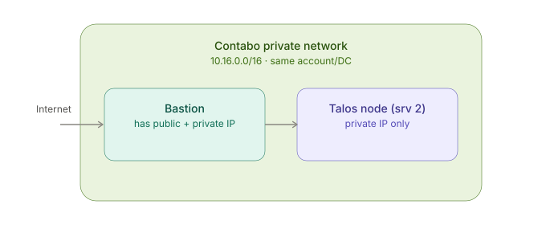

# hataraki_cluster

## Architecture



## Install Bastion

In bastion server
```bash
# Install talosctl
curl -sL https://talos.dev/install | sh

# Install kubectl
curl -LO "https://dl.k8s.io/release/$(curl -L -s https://dl.k8s.io/release/stable.txt)/bin/linux/amd64/kubectl"

chmod +x kubectl
mkdir -p ~/.local/bin
mv ./kubectl ~/.local/bin/kubectl
export PATH="$HOME/.local/bin:$PATH"
echo 'export PATH="$HOME/.local/bin:$PATH"' >> ~/.bashrc
```

In talos servers
```bash
# Extract IP and Gateway
ip address
ip route | grep default

# Flash Talos Image
lsblk

curl -fL -o metal-amd64.raw.xz https://factory.talos.dev/image/376567988ad370138ad8b2698212367b8edcb69b5fd68c80be1f2ec7d603b4ba/v1.14.1/metal-amd64.raw.xz

xz -t metal-amd64.raw.xz
xz -d metal-amd64.raw.xz

dd if=metal-amd64.raw of=/dev/sda bs=4M status=progress conv=fsync
# Manually reboot from Contabo
```
Manually using the UI and VNC, configure the same plublic IP and gateway as Contabo assigned originally

Botstrap from Bastion to first control plane
```bash
CLUSTER_NAME=name
CONTROL_PLANE_IP=controlplane_ip
# Get disks from talos server
talosctl get disks --insecure --nodes $CONTROL_PLANE_IP
DISK_NAME=capture_disk_with_more_space

# Create cluster, do it only with one control plane
talosctl gen config $CLUSTER_NAME https://$CONTROL_PLANE_IP:6443 --install-disk /dev/$DISK_NAME

# Apply cluster config to each control plane
talosctl apply-config --insecure --nodes $CONTROL_PLANE_IP --file controlplane.yaml

# Apply work config to each worker
talosctl apply-config --insecure --nodes "$WORKER_IP" --file worker.yaml

# Set endpoints
talosctl --talosconfig=.talos/talosconfig config endpoints $CONTROL_PLANE_IP

# Bootstrap etcd
talosctl bootstrap --nodes $CONTROL_PLANE_IP --talosconfig=.talos/talosconfig

# Get kubeconfig
talosctl kubeconfig --nodes $CONTROL_PLANE_IP --talosconfig=.talos/talosconfig

# Store kubeconfig
cat ~/.kube/config

# Allows pod scheduling in control planes if needed
kubectl taint nodes $CONTROL_PLANE_NODES node-role.kubernetes.io/control-plane:NoSchedule-
```

Bootstrap kubernetes
```bash
kubectl kustomize infra/kube/talos_infrastructure/bootstrap/01-flux-operator --enable-helm | kubectl apply -f -
kubectl kustomize infra/kube/talos_infrastructure/bootstrap/02-flux-instance --enable-helm | kubectl apply -f -
```

It generates files in:
`Created /home/bastion/controlplane.yaml, Created /home/bastion/worker.yaml, Created /home/bastion/talosconfig`

## Setup Instructions

Populate `infra/ansible/inventories/prod/hosts.yaml` file, then roll out cluster with ansible

```bash
cd infra/ansible
ansible-playbook playbooks/site.yaml
```

## Keycloak configuration

- Keycloak first user has admin, so the first login another admin should be created and the temporal admin should be deleted.
- In google auth https://console.cloud.google.com/auth/clients, a Oauth client must be created, capturing `client-id` and `client secret`.
- In keycloak an Identity Provider with Google must be created.
- Use the `client-id` and `client secret` from google and set them in the Identy Provider configuration, then capture `Redirect URI` and store it in Oauth in google console.
- Create a realm: hatarakiassistant
- Create a client called `vault` with the following inputs:
* Client-id: vault
* Valid redirect URIs: <VAULT_HOSTNAME>/ui/vault/auth/oidc/oidc/callback
* Client Authentication: true
* PKCE Method: S256
* Create a role: vault-role
* Capture token`: Client Secret

## Vault Configuration

- Setup the first secret engine.
- Setup a new authentication method, this must be done via CLI since UI does not support all options to enable keycloak OAUTH
- On vault CLI:
```bash
kubectl exec -it $VAULT_POD_NAME -n vault -- sh
export VAULT_TOKEN=$VAULT_ROOT_TOKEN
# Configure oidc
vault write auth/oidc/config oidc_discovery_url="$KEY_CLOAK_URL/realms/hatarakiassistant" \
   oidc_client_id='vault' \
   oidc_client_secret=$CLIENT_SECRET \
   default_role='vault-role'

vault policy write admin-policy - <<EOF
path "$SECRET_ENGINE_NAME/*" {
  capabilities = ["create", "read", "update", "delete", "list"]
}
EOF

vault write auth/oidc/role/vault-role \
    bound_audiences="vault" \
    allowed_redirect_uris="https://$VAULT_HOSTNAME/ui/vault/auth/oidc/oidc/callback" \
    user_claim="email" \
    policies="default,admin-policy" \
    ttl="1h"
```

## Access Management Vault

- After the first user has login with a google account, a new entity will appear, mapping the email to the name.
Go to Access - Groups, create a new group, add the existing policy `admin-policy`, and find the authenticated entity via google to then add it.
- Once the user logout and login, he/she should be able to see the desired secret engine.

- Create an `kube` policy with the following permissions:
```hcl
path "hatarakiassistant_secrets/data/*" {
  capabilities = ["read", "list"]
}

path "hatarakiassistant_secrets/metadata/*" {
  capabilities = ["read", "list"]
}
```

- Enable kubernetes auth in vault.
- Get kubernetes hostname and token
```bash
# Get kubernetes hostname
KUBERNETES_HOST=$(kubectl config view --raw --minify --flatten -o jsonpath='{.clusters[0].cluster.server}')

# Get the service account token
TOKEN_REVIEWER_JWT=$(kubectl get secret vault-auth-token -n vault -o jsonpath='{.data.token}' | base64 -d)
```

- Configure service account in vault
```bash
kubectl exec -it $VAULT_POD_NAME -n vault -- sh

# Enable kubernetes
vault auth enable kubernetes

# Configure kubernetes config
vault write auth/kubernetes/config \
  token_reviewer_jwt="$TOKEN_REVIEWER_JWT" \
  kubernetes_host="$KUBERNETES_HOST" \
  kubernetes_ca_cert=@/var/run/secrets/kubernetes.io/serviceaccount/ca.crt \
  disable_iss_validation=true

# Configure external secrets role
vault write auth/kubernetes/role/external-secrets-role \
  bound_service_account_names=vault-auth \
  bound_service_account_namespaces=vault-auth \
  policies=kube \
  ttl=24h
```

## Backup

Protondrive is supported to perform backup:
- install and configure rclone:
```bash
curl -fsSL https://rclone.org/install.sh | sudo bash
rclone config
# Enter username and password
```

- Read credential files from `~/.config/rclone/rclone.conf`, and store them in vault:
* proton_client_access_token
* proton_client_refresh_token
* proton_client_salted_key_pass
* proton_client_uid
* proton_password
* proton_username


## Notes

- Flux will automatically sync every 10 minutes
- Dependencies ensure components deploy in correct order
- cert-manager will automatically provision SSL certificates
- Traefik will use the wildcard certificate for HTTPS
- All apps will automatically get certificates through the gateway